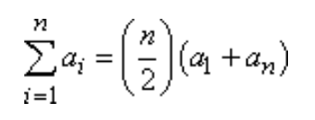
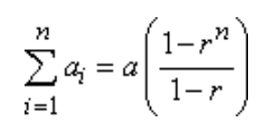
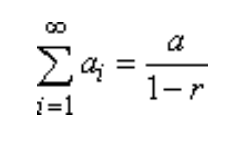

## Asymptotic Analysis
#### Proof by...
- __Counterexample__
	- show an example which does not fit with the theorem
	- Thus, the theorem is false.
- __Contradiction__
	- assume the opposite of the theorem
	- derive a contradiction
	- Thus, the theorem is true.
- __Induction__
	- prove for a base case (eg. n = 1)
	- assume for all n <= k (for arbitrary k)
	- prove for the next value (n = k + 1)
	- Thus, the theorem is true

- - -

### Induction (format)
- Prove: 1 + 2 + 3 + ... + n = n(n+1)/2
- Step before: Identify the variable (eg. var is __n__ in this case)
- Base case: n = 1, 1 = 1
- Induction hypothesis: Assume true for n=k, 1+2+3+...+k = k(k+1)/2, show that it's true for n=k+1
- Induction steps: ...
- This concludes our inductive proof. Therefore 1 + 2 + 3 + ... + n = n(n+1)/2

QED

- - -

### Analysis of Algorithms
- How long the program runs (Time complexity) and how much memory it uses (Space complexity)
- Input size n (a non-negative integer, sometimes multiple measure)
- Example of running time:
	- T(n) =  4n + 5
	- T(n) = 0.5nlog(n) - 2n + 7
	- T(n) = 2^n + n^3 + 3n


- - -

### Big-O Notation


#### Big-Omega and Big-Theta Notation


### L’Hospital’s Rule


### Typical Asymptotics


#### Sample Asymptotic Relations


#### Runtime Example:
```python
	i = 1
	while i < n:
		for j = 1 to i:
			sum = sum + 1
		i += i
```
- For each 'while loop', the inner 'for loop' gets runned for i times
- i = 1, 2, 4, 8, 16...
- Hence in total, T(n) = 1 + 2 + 4 + 8 + 16...  => Sum(2^k) [k=0, ceil(__lg(n)__)-1]
- Formula that should be implanted as a computer scientiest:
- __Sum(2^k) [k=0, n] = 2^(n+1) - 1__
- Hence, T(n) = 2^ceil(lg(n)) - 1 <= 2^(lg(n)+1) - 1 <= 2n - 1
- Therefore, T(n) ∈ Θ(n)

- - -

### Arithmetic Sequences
Find value at term __n__, given initial term = __a__, and diff = __d__:


Summation of Arithmetic Sequences:



### Geometric Sequences
Find value at term __n__, given initial term = __a__, and common ratio = __r__:


Summation of Geometric Sequences:



Special case when abs(r) < 1:



- - -

### [Summation of 2 to the power of n](http://math.stackexchange.com/questions/22599/how-do-i-prove-this-by-induction-sum-of-powers-of-2)
Prove that for every natural number __n__,


### Solving Recurrence

#### Substitution:


