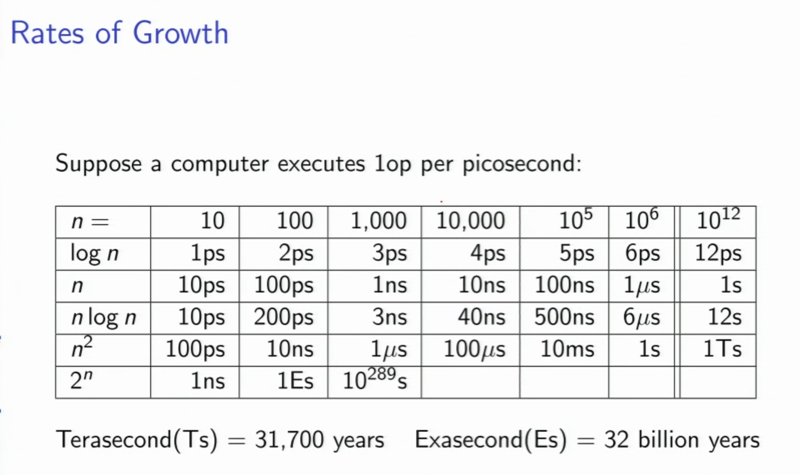
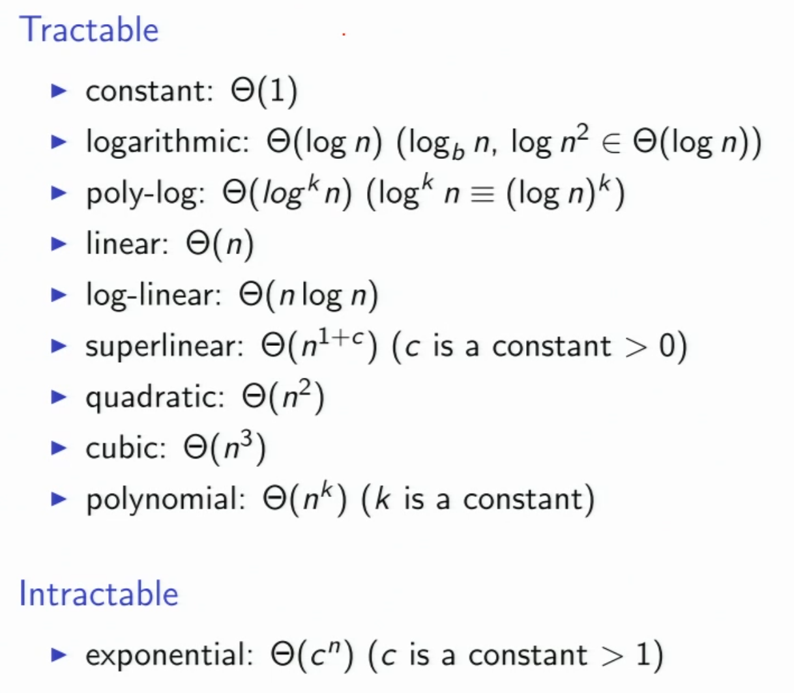

## Asymptotic Analysis
#### Proof by...
- __Counterexample__
	- show an example which does not fit with the theorem
	- Thus, the theorem is false.
- __Contradiction__
	- assume the opposite of the theorem
	- derive a contradiction
	- Thus, the theorem is true.
- __Induction__
	- prove for a base case (eg. n = 1)
	- assume for all n <= k (for arbitrary k)
	- prove for the next value (n = k + 1)
	- Thus, the theorem is true

- - -

### Induction (format)
- Prove: 1 + 2 + 3 + ... + n = n(n+1)/2
- Step before: Identify the variable (eg. var is __n__ in this case)
- Base case: n = 1, 1 = 1
- Induction hypothesis: Assume true for n=k, 1+2+3+...+k = k(k+1)/2, show that it's true for n=k+1
- Induction steps: ...
- This concludes our inductive proof. Therefore 1 + 2 + 3 + ... + n = n(n+1)/2

QED

- - -

### Analysis of Algorithms
- How long the program runs (Time complexity) and how much memory it uses (Space complexity)
- Input size n (a non-negative integer, sometimes multiple measure)
- Example of running time:
	- T(n) =  4n + 5
	- T(n) = 0.5nlog(n) - 2n + 7
	- T(n) = 2^n + n^3 + 3n

- - -

### Big-O Notation

#### Big-Omega and Big-Theta Notation

### L’Hospital’s Rule

### Typical Asymptotics

#### Sample Asymptotic Relations

