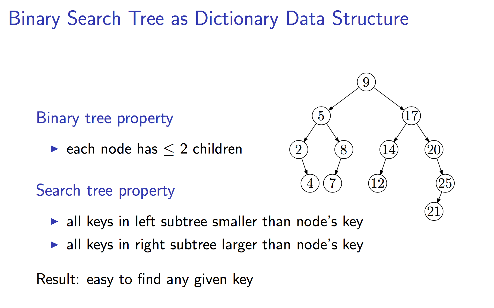
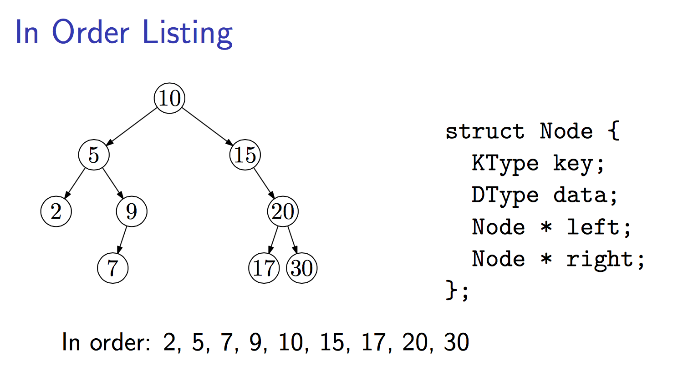
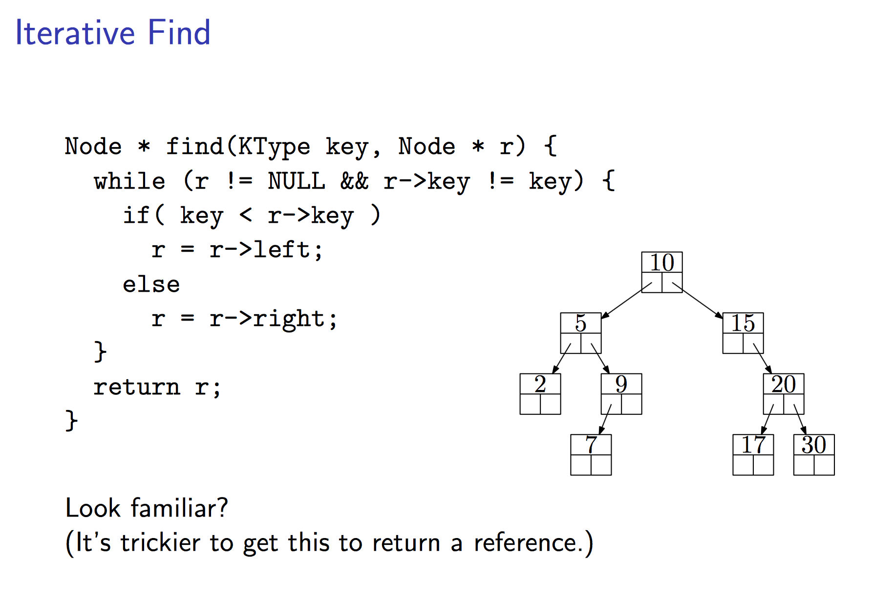

# Binary Tree

## Introduction
#### Binary tree is:
- Empty, or 
- Root and its left and right binary subtrees
- Formal definition: binary tree is a tree data structure in which each node has at most two children, which are referred to as the left child and the right child. 

#### Properties 
- Max # of leaves (height h): 2<sup>h</sup>
- Max # of nodes (height h): 2<sup>h+1</sup> - 1
- Height (n nodes): floor( lg(n) )




### Listing


```python
# In-order listing:
Recurse(left)
Visit(root)
Recurse(right)
# Result: 2, 5, 7, 9, 10, 15, 17, 20, 30

# Pre-order listing:
Visit(root)
Recurse(left)
Recurse(right)
# Result: 10, 5, 2, 9, 7, 15, 20, 17, 30

# Post-order listing:
Recurse(left)
Recurse(right)
Visit(root)
# Result: 2, 7, 9, 5, 17, 30, 20, 1
```




### BST Insertion


__Runtime__:

- Worst case: Θ(n<sup>2</sup>)
- Average case: Θ(n log n) (assuming all orderings equally likely)

---


### BST Deletion