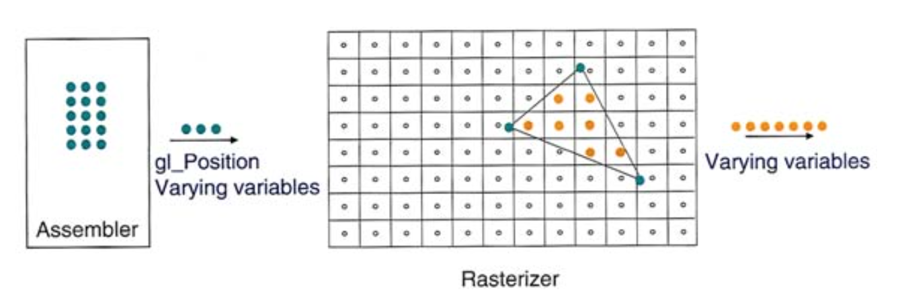
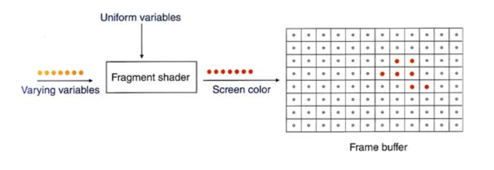

# CPSC 304 Computer Graphics

### OpenGL Pipeline

#### Vertex Shader
- Shapes are “discretized” into primitives: __triangles__, line segments, ...
- Vertices are stored in a vertex buffer.
- When a draw call is issued, each of the vertices passes through the vertex shader
- On input to the vertex shader, each vertex (black) has associated attributes.
- On output, each vertex (cyan) has a value for gl_Position and for its varying variables.

#### Rasterization (光栅化)
- The data in gl_Position are used to place the three vertices of the triangle on a virtual screen.
- The rasterizer figures out which pixels (orange) are inside the triangle and interpolates the varying variables from the vertices to each of these pixels.

#### Fragment Shader
- Each pixel (orange) is passed through the fragment shader, which computes the final color of the pixel (pink).
- The pixel is then placed in the framebuffer for display.
- By changing the fragment shader, we can simulate light reflecting off of different kinds of materials.

### Texture Mapping

- A simple geometric object described by a small number of triangles.
- Details stored in an auxiliary image called a texture.
- Traingles <=> Textures map to form graphics

---
### Linear Algebra

#### Points and Vectors
- A vertex is not a point, it consists of attributes such as: point, normal, color, neighbours...
- Vector = Magnitude + Direction
- Magnitude of a vector = Length = Norm of a vector == ||a||
- Vector space: eg. R2 = 2D space, R3 = 3D space
- A vector space is a set V on which two operations + and · are defined, called vector addition and scalar multiplication.
	- Closure: If u and v are any vectors in V, then the sum   u + v   belongs to V.
	- Closure: If v in any vector in V, and c is any real number, then the product   c · v   belongs to V.

#### Linear combinations and span
Let V be a R-vector space and v1,...,vk ∈ V. A linear combination of these vectors is any expression of the form:  
_c1v1 + c2v2 + ... + ckvk_  
where the coefficients c1, c2 ... ck are scalars.

- span(v1,...,vk) = Rk

#### Basis

#### Orthonormal basis

#### Dot product

#### Orthogonal

---
Let V be a R-vector space and v1,...,vk ∈ V. If vk is in the span of v1, ..., vk-1, then:  
 _span{v1,...,vk} = span{v1,...,vk-1}_

>Theorem 1: Given a system of n equations and m unknowns there will be one of three
possibilities for solutions to the system.

>1. There will be no solution.
2. There will be exactly one solution.
3. There will be infinitely many solutions.

>If there is no solution to the system we call the system inconsistent and if there is at least one solution to the system we call it consistent.

