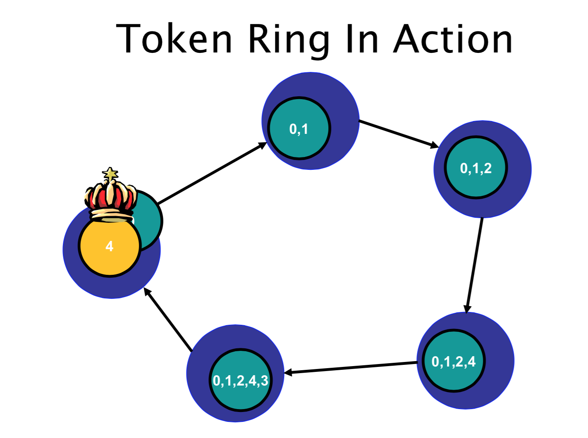
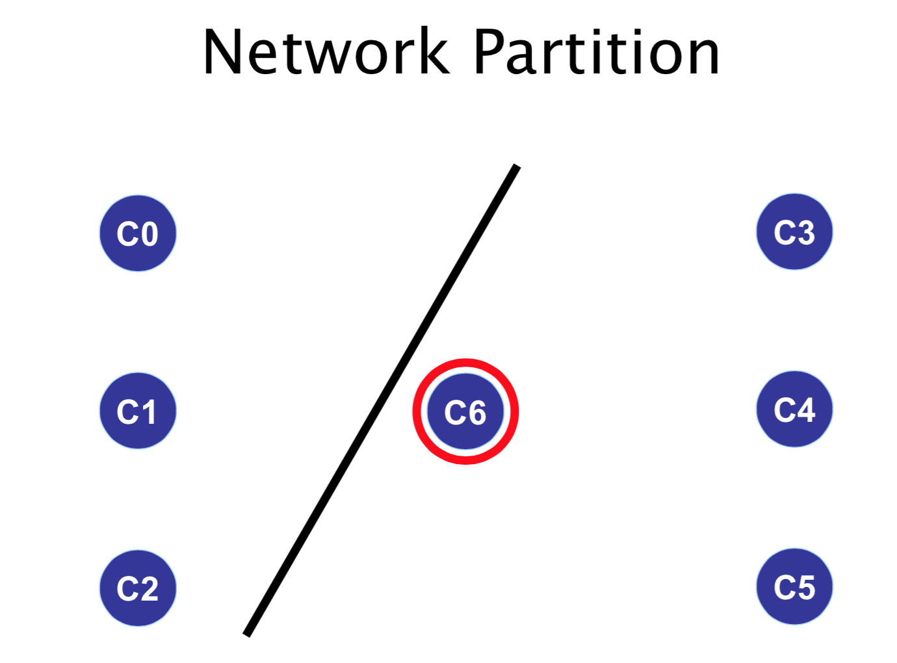

# CPSC 416 Distributed Systems

#### Pitfalls when Developing Distributed Systems
1. The network is reliable.
2. The network is secure.
3. The network is homogeneous.
4. The topology does not change. 
5. Latency is zero.
6. Bandwidth is infinite.
7. Transport cost is zero.
8. There is one administrator

## Design goals
- Heterogeneity 
	- Systems constructed from: Networks, Computer hardware, and Software
	- The challenge is must get these different systems and environments to inter-operate
- Concurrency 
	- The ability of a system component (e.g., server) to handle multiple simultaneous operations
	- Distributed systems are naturally concurrent (multiple clients operating in parallel)
	- Bottleneck: single server or network.
	- Server may stall while processing a client request; while request is stalled, server should be able to start other requests
- Scalability
	- The ability of a component to handle increased load without significant change
		- Changes to handle increased load should be proportional to the load increase
		- Performance degradation should be proportional to load increase
	- Key goal is to require incremental changes to a system as load increases
	- Allows server to handle increasing client load, this is a key issue for web-based systems
	- Don’t try to scale arbitrarily
		- Generalized scalability results in increased complexity, costs, and time to market
	- Key design constraints: expected system size and growth
	- Focus for expected size, and provide for scaling to handle growth
	- CND: Content Delivery Networks
		- Address translation: from url like espn.com to url of nearby content server
- Openness
	- Two types of openness are important: non-proprietary and extensibility
	- Non-proprietary: public protocols allows clients and servers from different vendors to talk to each other
	- Extensibility is the ability to customize to meet unanticipated needs.
- Fault Tolerance
	- Tolerate partial failures
	- Dealing with partial failure
		- Recoverability: persistent data and for long-running computations, and prevent loss or corruption of data
		- Availability: prevent service interruption
- Security (Privacy and Authentication) 
	- Sender: should be able to control what other programs and people can read or modify the message
	- Receiver: should be able to identify message sender
	- Privacy (protect against eavesdropping) and authentication (know who you are talking to)
	- Key mechanism: cryptography
- Transparency
	- Goal: make distributed programming as easy as local so solve all previous problems
	- How: hide hard stuff behind software abstraction and present single system image to programmers

__Types of transparency__:

- Access transparency
	- Identical operations used to access object regardless of local/remote
	- Important because it simplifies remote access
- Location transparency
	- Access to remote object without knowing where object is or how to find it
	- Important because can move or replicate objects without telling clients
	- Ideally would like location and access transparency together
- Performance transparency
	- Access to remote object as fast as access to local object
	- Hard because remote access is usually slower, sometimes the difference doesn’t matter, but sometimes it does
- Failure & Security Transparency
	- Failure Transparency: Conceals faults allowing applications to complete despite other hardware/software failures
	- Security Transparency: The ability to provide different levels of privacy or authentication without changing the distributed application

__Other Transparencies__:

- Mobility: Migration - moving a resource, Relocation – moving while in use
- Replication – hides the fact there may be replicas (need same name and contents)
- Concurrency/scaling transparency – hide the fact there could be multiple simultaneous users – resource stays consistent and access time constant

## Design Challenges

### Naming
- __Identifiers__: Name used to directly access a resource
	- Examples: IP address & port number, URL, mailing address
	- Not location transparent 
- __Pure name__: A location-transparent name
	- Compared to an identifier:
		- (+) move or replicate without changing name
		- (–) difficult (slow) to locate resource
		- (–) name encodes no location information
	- Examples: IP domain names, your name
- __Resolution__: converting pure name -> identifier
	- Examples: DNS, Phone book (name => number), “open” (Filename => inode)
- __Name contexts__:
	- Name’s meaning can depend on context
	- Examples: domain names (context is IP),  local phone numbers (context is Vancouver) 
- __Protection using ACLs__:
	- Access Control Lists (ACL) attached to resources, list users that can access the resource
	- Requires user authentication, user list is maintained on every resource and permission is checked on every access
- __Capabilities__: Names do two things:
	- name resource
	- grant permission to access the resource
	- a client that holds a capability for a resource has everything needed to access the resource
	- Access control: permission granted when capability issued, and access allowed when valid capability is presented

### Workload Allocation
- Key goal is to use resources efficiently by allocating load evenly among processors
- There are two models:
	- Centralized access to a processor pool
	- Collection of loosely coupled computers

#### Processor pool model
- Put workstations in a closet
- Tightly-coupled operating system or middleware
	- users access via a common shared access point
	- users log into pool not an individual machine
	- system allocates work to different processors to balance load
	- Example: Cloud Computing

#### Loosely Coupled Approach
- Everybody has their own processor
	- connected in a loosely-couple fashion (WAN)
- Problem is that load is not well balanced: processing power barely used or idled

#### Utilizing Idle Workstations
- Benefits: move programs from overloaded nodes
- __Key Issue__: can’t impact users who “own” the processor and owner has priority

---
### Consistency Maintenance
- Four key aspects to consistency
	* __Atomicity__: All-or-nothing property
		- Want all operations to complete or none
		- Issue: operations may include multiple nodes
		- Examples: Transfer between savings and chequing accounts, Internet commerce
	* __Coherence__: Keeping replicated data consistent
		- Why? Increases availability and improves performance
		- Issue: when one copy of an object is updated the system must maintain coherence by updating or invalidating the other copies
		- To maintain consistency we often need to know the order things happened 
	* __Clock Consistency__: Consistent view of time and event ordering
		- Issue: network messages and network performance is unpredictable and the exchange of messages takes time
		- Challenge: establish event ordering
	* __Failure Consistency__: 
		- Fail-stop model: components fail only by stopping instead of giving a “wrong” answer, a simplified failure model 
		- Byzantine failure model: 

## Network
Network = Host + Adapters + Wire + Switches/Routers + Software

#### Network Characteristics
- communication style: Unicast, point-to-point, or multicast/broadcast; order
- performance: rate, delay, and predictability; fairness

#### Performance Metrics
- __Throughput__: network transfer rate
	- e.g., use to determine maximum rate to be used to guarantee a level of video quality
- __Latency__: network delay for sending a single message
	- e.g., used to determine how long it will take to download a web page
- __Jitter__: fluctuations in message latency
	- e.g., used to determine how much streaming media should be buffered
- __Packet Loss Rate__: represents the extreme cases or subsets of the above situations

---

## Distributed Coordination

- __Coordinator__: a node that organizes the actions of a set of nodes
- __Problems__: 
	- How to decide on what node or nodes should take over the role of the failed node.
	- How do we ensure that the data the “new” node is going to use is up to date.

#### Coordinator failure
- __Goal__: implement a strategy to deal with coordinator failure
- Two main issues:
	- Picking a new coordinator: detect failure and deal with it
	- Reconstructing coordinator state

#### Electing a new coordinator
- __Key Problem__: must do this without a coordinator
- Detecting failure:
	- any node might detect failure first
- Election:
	- name for process of reaching agreement
	- must run without coordination
	- must deal with arbitrary node failures
	- all the nodes must agree who new coordinator is when election is over
- Key ideas:
	- Before failure: nodes agree on a strategy, and assign total order on nodes
	- After failure:
		- use order to find the “highest” surviving node
		- use broadcast so that all nodes agree

### Election algorithms

#### Bully algorithm
- __Assumption__::
	- every node knows about every other node
	- every node has a unique node number
- __Invariant__:
	- node with highest number is always coordinator
-__Bully election__:
	- held whenever coordinator failure detected
	- reach global agreement on highest remaining node number

- Three types of messages:
	- elect, answer, coord
- Start election
	- send elect to all nodes with higher numbers, and wait for at least one answer
- When elect received
	- reply with answer, and start a new election
- New coordinator
	- is node that starts election but receives no answer
	- it sends coord message to all nodes with lower numbers
	- coord message include new list of nodes
- Adding nodes: call election if new node number is highest

#### Runtime
- __Base case__:
	- node with second highest id detects failure
	- total messages = n-2 (coord messages, less with broadcast)
- __Worse case__:
	- node with lowest id detects failure
	- total messages = O(n2)
- __Election latency__:
	- 3 sends + 1 timeout

---
#### Ring algorithm
- Organize nodes logically into a ring
- When a node detects a failure
	- send elect to neighbor, includes node number
	- If neighbor down, try its neighbor, and so on
- When node receives elect:
	- if not in node set, adds node number to elect and passes it on
	- otherwise, pick highest node in node set as coordinator, 
	- and send coord message around ring to nodes in node set
- Doesn’t tolerate failures very well

#### Runtime
- __Messages required__: 2n (n for elect message and n for coord message)
- __Election latency__: 2n - 1 sends to (n-1)(timeouts)

### Network Partition
- A network partition is a network failure that divides the distributed system into multiple connected sub-networks
- __Problem__:
	- ensure that there is only a single coordinator even if network partitions
- __Solution__:
	- quorum protocol: elect coordinator only if at least half the nodes exist in a partition

### Quorum protocols
- Assigning votes
	- every node has V votes (e.g., 1)
	- every network has a quorum, Q >= Vtotal/2 + 0.5
- When electing new coordinator
	- tally votes from all surviving nodes, into T
	- if T < Q do not elect a new coordinator
- In coordinatorless partitions
	- nodes fail or stall until partition “heals”

---

## Time & Physical Clocks
