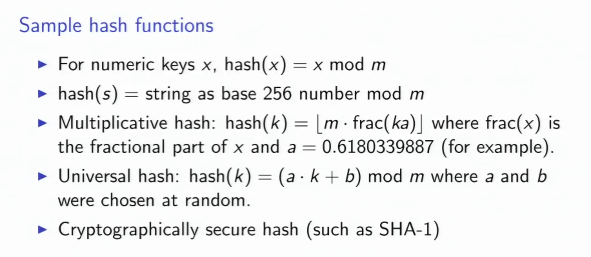
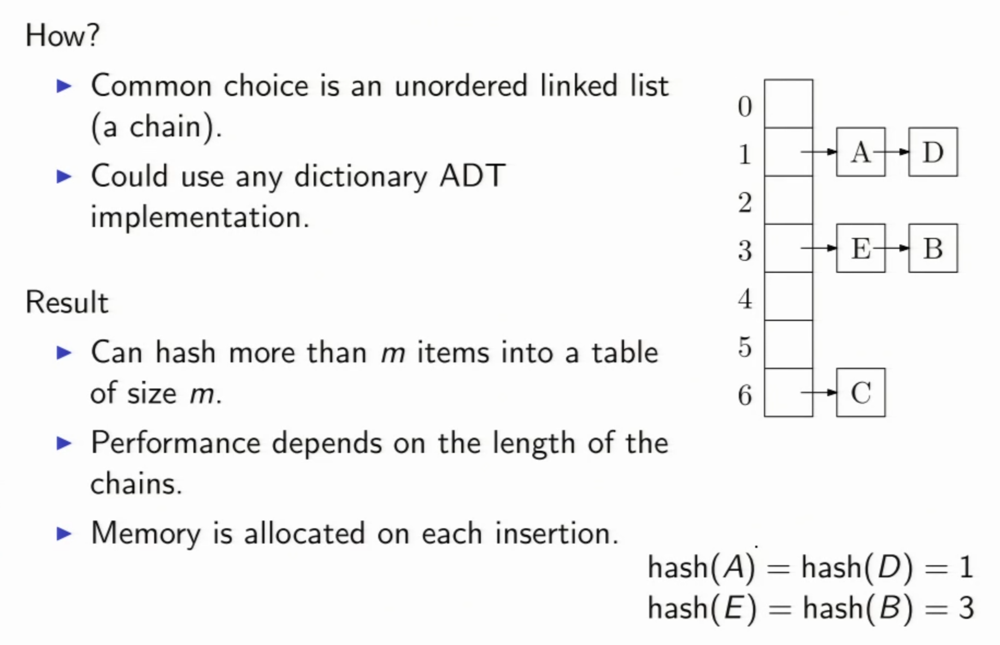
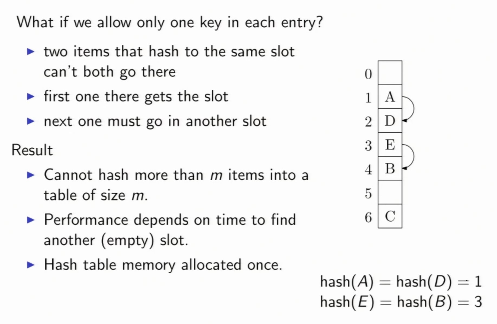
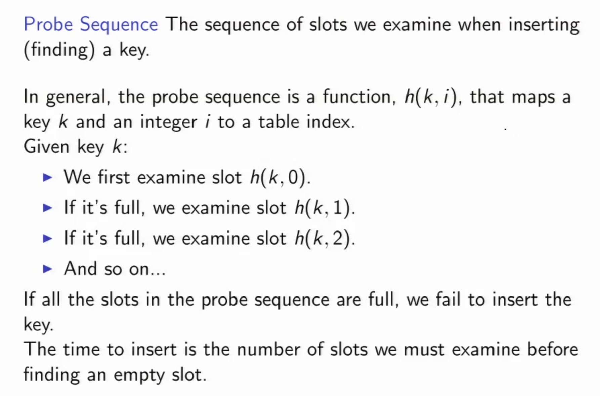

# Hashing

### Hash table
Using a hash table to implement a dictionary ADT, then the find operation is:
```cpp
find('GNU') == 'GNU is not Unix';
Value find(Key key) {
	int index = hash(key) % m;
	return HashTable[index];
}
```

- hash( ) is a hashing function, and ideally m is chosen to be a prime number.
- a ideal hash function should be fast to compute and causes few collisions.
- m chosen to be prime number to avoid collisions caused by patterns in key values.

### Hashing string (Horner's Rule)
```cpp
m = table_size

int hash(string s) {
	int h=0;
	for (i = s.length()-1; i>=0; i--) {
		h = (256*h + s[i]) % m;
	}
	return h;
}

```


### Pigeonhole principle
- If more than m pigons fly into m pigeonholes then some pigeonhole contains at least two pgeons.
- __Corollary__: If we hash n > m keys into m slots, two keys will collide.

#### Pigeonhole principle examples:

__Example 1__: Consider n+1 distinct positive integers, each <= 2n. Show that one of them must divide one of the others.  
For instance, if n=4, consider the following sets: {1, 2, 3, 7, 8}, {2, 3, 4, 7, 8}, {2, 3, 5, 7, 8}

__Proof__: 

- Any integer can be written as 2<sup>k</sup> × q, where k is an integer and q is odd. (eg. 129 = 2<sup>0</sup> × 129, 60 = 2<sup>2</sup> × 15)
- Between [1, 2n], there are n odd numbers (holes = n)
- There are n+1 integers, each of which is comprised of 2<sup>k</sup> × q, so for {x<sub>1</sub>, x<sub>2</sub> ... x<sub>n+1</sub>}, there are n+1 possible choices of the odd number q. (pigeons = n+1)
- Hence, there exists x<sub>i</sub> and x<sub>j</sub>, such that q<sub>i</sub> = q<sub>j</sub>, according to the pigeonhole principle.
- Therefore, (x<sub>i</sub> | x<sub>j</sub>) or (x<sub>j</sub> | x<sub>i</sub>)

### Collision Resolution
__Birthday Paradox__: With probability > 50%, two people, in a room of 23, have the same birthday.  
__Corollary__: If we randomly hash only sqrt(2m) keys into m slots, we get a collision with probability > 1/2.  
__Collisions__: When two keys hash to the same entry.  

1. Chaining: store multiple items in each entry  
2. Open addressing: pick a next entry to try

## Hashing with Chaining
> Store multiple items in each entry


#### Hash: Chaining Code

```cpp
Dictionary &findSlot(const Key &k) {
	return [hash(k) % table.size];
} 

void insert(const Key &k, const Value &v) {
	findSlot(k).insert(k, v);
}

void delete(const Key &k) {
	findSlot(k).delete(k);
}

Value &find(const Key &k) {
	return findSlot(k).find(k);
}

// Pass in by reference because of efficiency concern
``` 

#### Access time for Chaining
- __Load Factor__: ɑ = (# hashed items)/table_size = n/m (Meaning on average, there are ɑ items in each slot.)
- __Search cost__: 
	- an unsuccessful search examines ɑ items
	- a successful search examines 1 + (n-1)/2m items
- We want the __load factor__ to be small.

## Hashing with Open addressing
> Pick a next entry to try



### Probing


__Linear probing__: h(k, i) = (hash(k) + i) mod m
```cpp
Entry *find(const Key &k) {
	int p = hash(k) % size;
	for(int i=1; i<=size; i++) {
		Entry *entry = &(table[p]);
		if(entry->isEmpty()) return NULL;
		if(entry->key == k) return entry;
		p = (p+1) % size;
	}
	return NULL;
}
```
