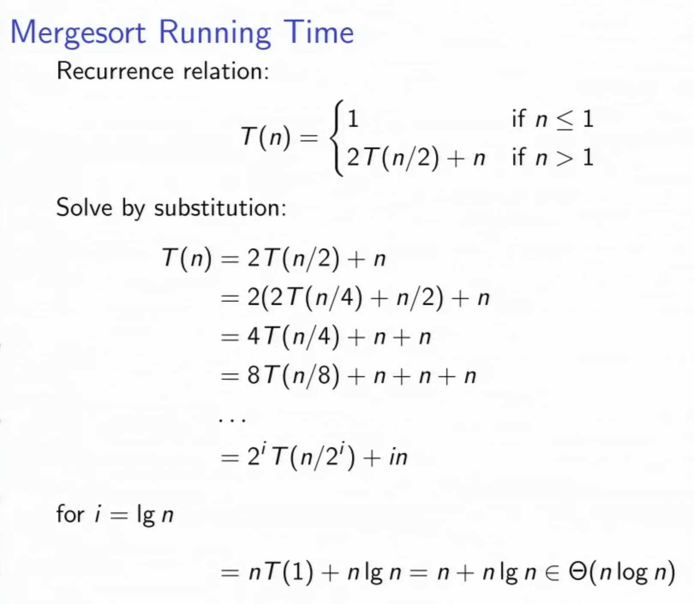
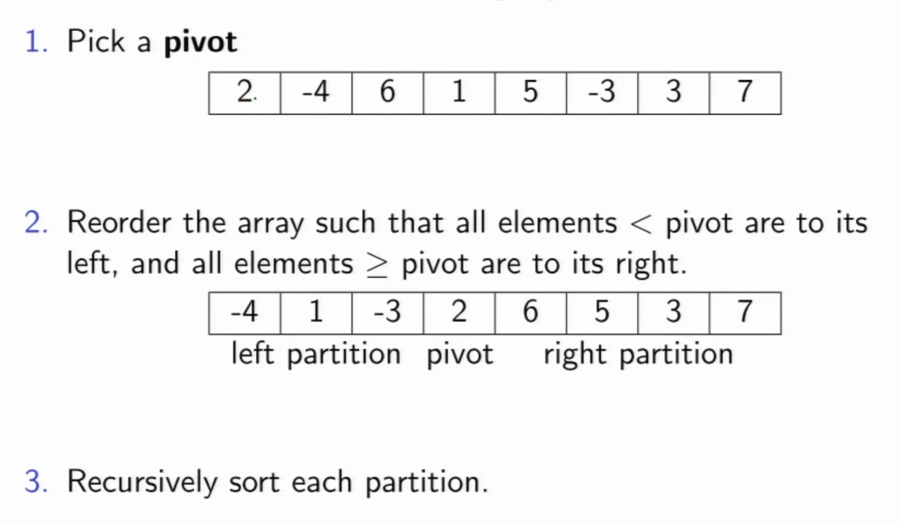
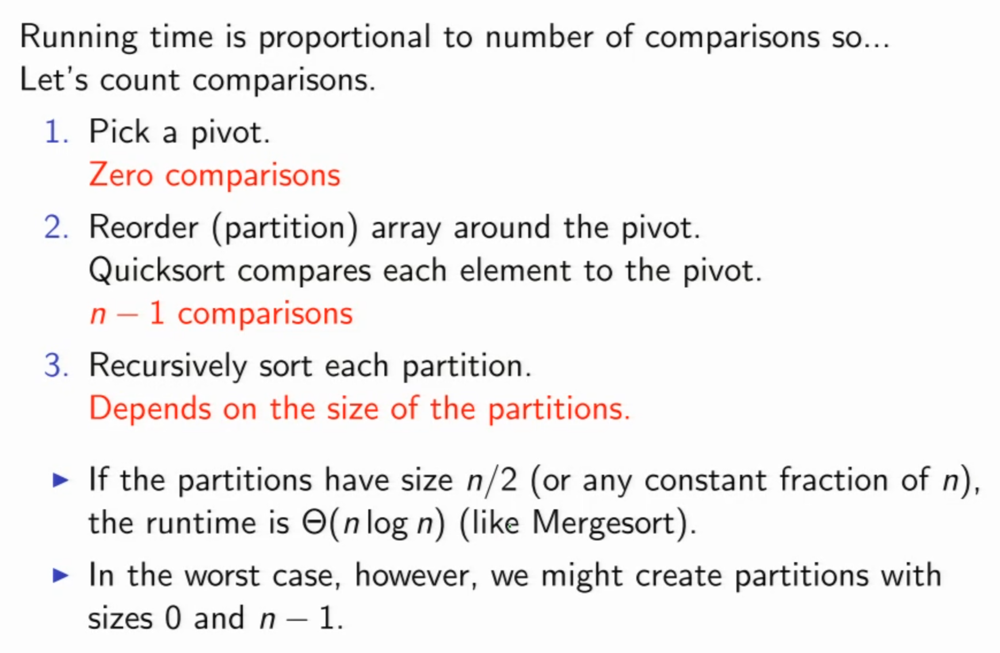
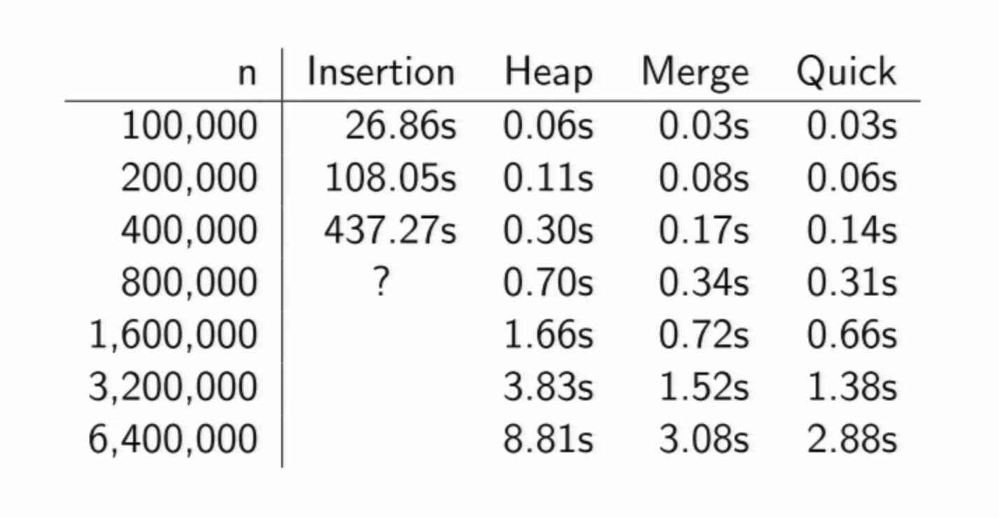
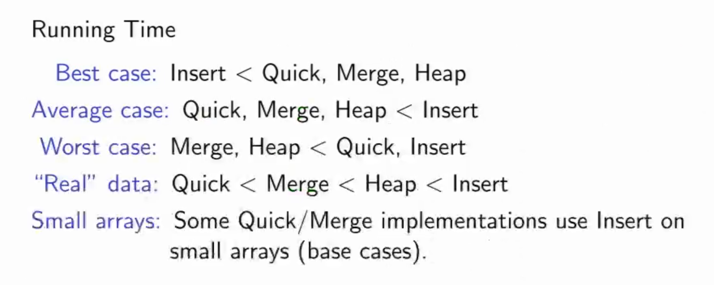
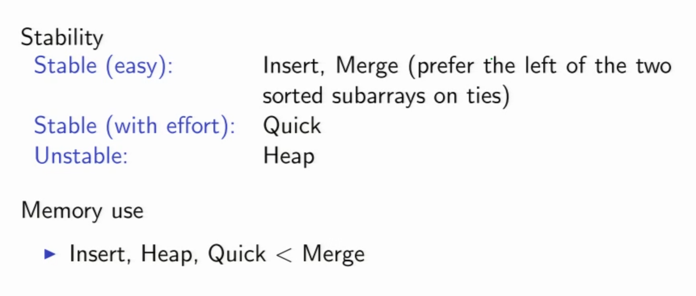

# Sorting

### Measure Sorting Algorithms
- Computational __complexity__ (eg. Runtime)
	- Worst case, Average case, Best case
- __Stability__: What happens to elements with identical keys?
- __Memory Usage__: How much extra memory is used

### Bubble sort
>__Definition__: Repeatedly steps through the list to be sorted, compares each pair of adjacent items and swaps them if they are in the wrong order. The largest number bubbles up to the end of the array in each outter iteration.


```python
for i=(n-1) to 1
	for j=0 to (i-1)
		if A[j] < A[j+1]
			swap(A[j], A[j+1])
```
__Runtime__: О(n<sup>2</sup>) Comparsions

### Insertion sort
>__Definition__: At the start of iteration i, the first i elements in the array are sorted, and we insert the (i+1)st element into its proper place. Insertion sort takes advantage of presorting, it only requires one comparsion per element for a presorted list.


```python
for (i=1 to n-1)
	j = i 
	while (j > 0 and A[j] < A[j-1])
		swap(A[j], A[j-1])
		j--
```
__Runtime__: О(n<sup>2</sup>) Comparsions  
__Stability__: Very stable  
__Memory__: Sorting is done in-place, a constant number of extra memory locations are used.

### Selection sort
>__Definition__: Given an array, search for the smallest element and swap it into the first position.

__Runtime__: О(n<sup>2</sup>) Comparsions. Generally, worse runtime compared to insertion sort.
__Stability__: Stable  
__Memory__: In-place

### Heapsort (1964)
>__Definition__: Divides its input into a sorted and an unsorted region, and it iteratively shrinks the unsorted region by extracting the smallest element and moving that to the sorted region

- Heapify input array
- Repeat n times: Perform deleteMin/Max

__Runtime__: О(n<sup>2</sup>) Comparsions  
__Stability__: Not stable, use index in input array to break down comparison ties. 
__Memory__: in-place. (Avoid using another array to store the result)

### Mergesort
>__Definition__: A divide and conquer algorithm

- If the array has 0 or 1 element, it's sorted, stop. __T(n) = 1__
- Split the array into two approximately equal-sized halves.
- Sort each half recursively (using Mergesort). __2T(n/2)__
- Merge the sorted halves to produce one sorted result. __n__

```cpp
void mergesort(int x[], int n) {
	int *tmp = new int[n];
	msort(x, 0, n-1, tmp);
	delete[] tmp;
}

void msort(int x[], int lo, int hi, int tmp[]) {
	if (lo >= hi) return;
	int mid = (lo+hi)/2;
	msort(x, lo, mid, tmp);
	msort(x, mid+1, hi, tmp);
	merge(x, lo, mid, hi, tmp);
}

void merge(int x[], int lo, int mid, int hi, int tmp[]) {
	int a=lo, b=mid+1;
	for (int k=lo; k<=hi; k++) {
		if (a <= mid && (b > hi || x[a] < x[b]))
			tmp[k] = x[b++];
		else 
			tmp[k] = x[b++];
	}
	for (int k=lo; k<=hi; k++)
		x[k] = tmp[k];
}

```


__Stability__: Stable  
__Memory__: Not in-place
### Quicksort (1961)
__Definition__: 


```cpp
void qsort(int x[], int lo, int hi) {
	int i, p;
	if (lo >= hi) return;
	p = lo;
	for(i=lo+1; i<=hi; i++) {
	if (x[i] < x[lo])
		swap(x[++p], x[i]);

	swap(x[lo], x[p]);
	qsort(x, lo, p-1);
	qsort(x, p+1, hi);
	}
}

void quicksort(int x[], int n) {
	qsort(x, 0, n-1);
}

// Invariant: x[lo] = pivot, x[lo+1...p] < pivot, x[p+1...i-1] >= pivot
// Example: [2, -4, 1, 6, 5, -3, 3, 7]
```


__Stability__: Stable  
__Memory__: In-place

## Sorting Algorithms Comparsion



