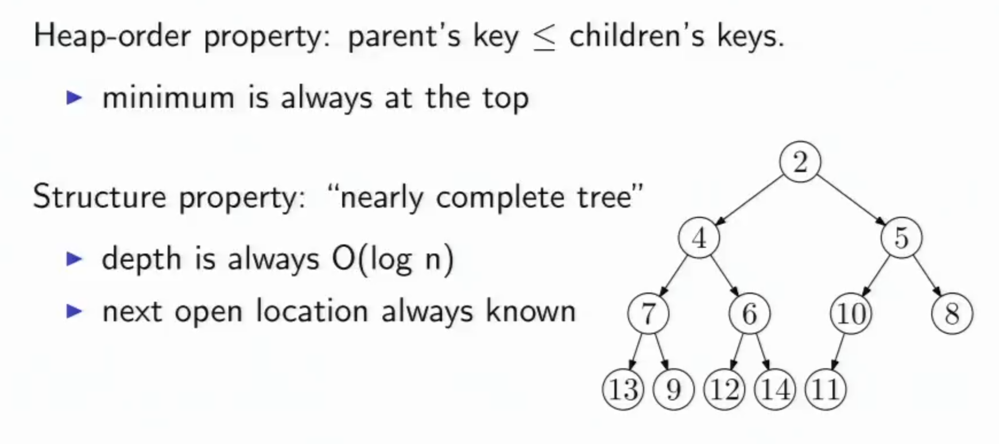
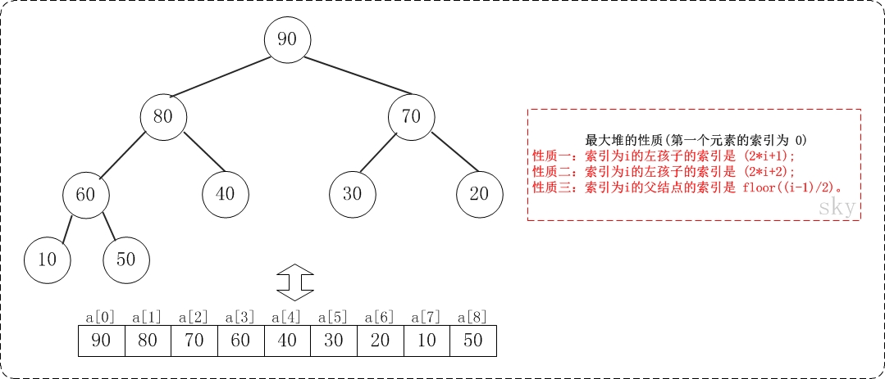

# Tree Terminology

__Depth__: Number of edges on the path from root to node. <br>
__Height__: Number of edges on the __longest__ path from node to descendent or for the whole tree, from root to leaf. <br>
__Degree__: Number of children of a node. <br>
__Complete__: As many nodes as possible for its height. (A complete binary three with height n, has 2<sup>n+1</sup> - 1 nodes in total. <br>
__Nearly complete__: Complete plus some nodes on the left at the bottom.
(n = total nodes, h = height of a nearly complete binary tree, then 2<sup>h</sup> - 1 < n <= 2<sup>h+1</sup> - 1 ) <br>
Given a binary tree with n nodes, height = floor( __lg(n)__ )
__Binary tree__: Implementations include binary search tree and binary heap.

## Binary Heap Priority Queue

__Heap__: A heap is a partially sorted __binary tree__. It can be thought of as __a priority queue__; the most important node will always be at the top, and when removed, its replacement will be the most important. Heaps can also be used to sort data. A heap sort is O(nlogn) efficiency.


When the root element is placed at index 0:



When the root element is placed at index 1:


### Max Binary Heap
#### Insertion:


#### Deletion of root:


#### Deletion of random node:


### Heapify: Create a Heap from a non-Heap Array
Fix the heap-order property (Max or Min) bottom up, use swapDown.
The first node that has children from bottom up is: __size/2 - 1__
```cpp
for ( i = size/2 - 1; i >= 0; i--) swapDown(i);
```
__Runtime__: nlg(n)

---
### d-Heap Navigation (Size n)

- j<sup>th</sup> - child(i) = d × i + j
- parent(i) = floor( ( i - 1 )/d )
- root = 0
- next free position = n

